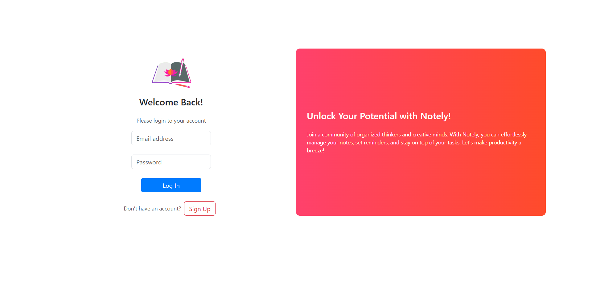
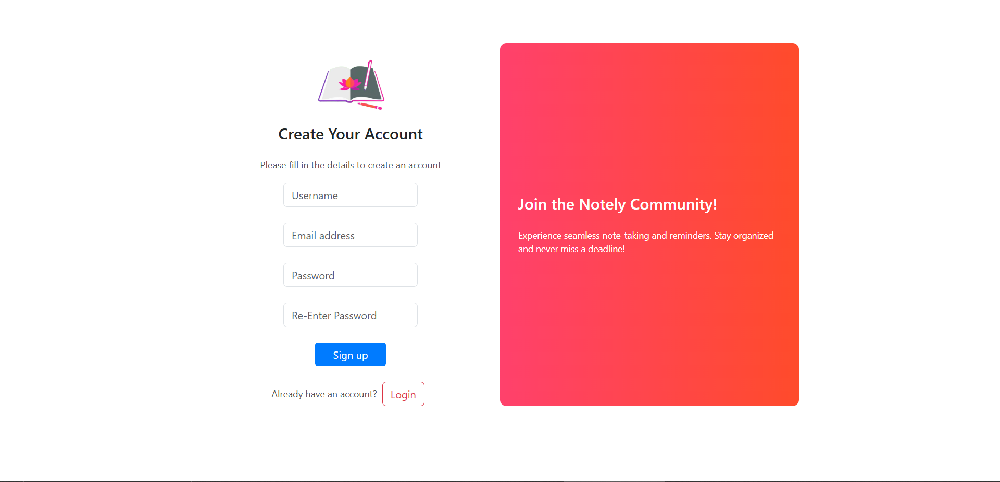
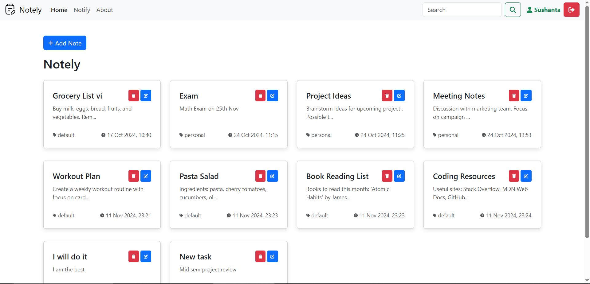
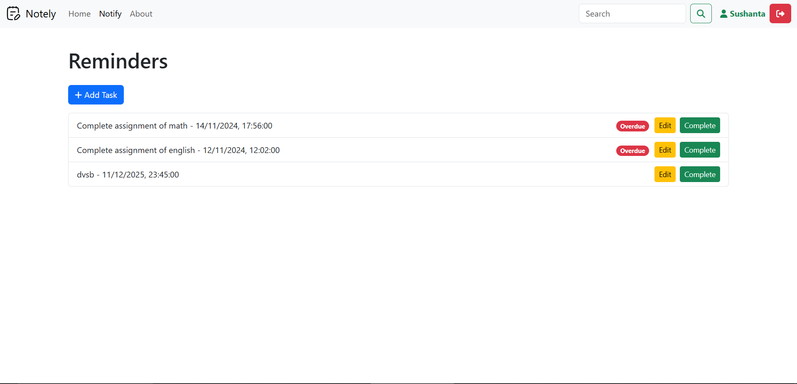

# 📝 Notely - Cloud-Based Note-Taking & Reminder App

**Notely** is a cloud-based note-taking application built with the **MERN** stack. It allows users to create, edit, organize, and manage notes efficiently while providing automated email notifications for reminders.

---

## 🚀 Features  
✔️ User Authentication with **JWT**  
✔️ Create, Update, Delete **Notes & Reminders**  
✔️ Automated Email **Reminder Notifications**  
✔️ Secure **MongoDB Database** Integration  
✔️ **Search Functionality** for Notes  
✔️ **Responsive UI** using React & Bootstrap  
✔️ **Cron Jobs** for scheduled task reminders  

---

## 🛠️ Installation & Setup  

### **1️⃣ Clone the Repository**  
```sh
git clone https://github.com/SushantaSarkar123/Notely.git
cd Notely
```

### **2️⃣ Install Dependencies (Root Directory)**  
Install `concurrently` to run both frontend and backend together:  
```sh
npm install
```

### **3️⃣ Backend Setup**  
Navigate to the backend folder and install dependencies:  
```sh
cd Notely_b
npm install  # Install backend dependencies
npm start    # Start the Express server
```

### **4️⃣ Notification Server Setup**  
Navigate to the notification server and install dependencies:  
```sh
cd ../NotifyServerBackend
npm install  # Install notification server dependencies
npm start    # Start the notification service
```

### **5️⃣ Frontend Setup**  
Navigate to the frontend folder and install dependencies:  
```sh
cd ../Notely-f
npm install  # Install frontend dependencies
npm start    # Start the React app
```

---
## 🔐 Environment Variables
Create a `.env` file in the **backend** folder and configure:
```plaintext
MONGO_URI=your_mongodb_connection_string
JWT_SECRET=your_jwt_secret_key
EMAIL_USER=your_email@gmail.com
EMAIL_PASS=your_app_password
```
---

## 📸 Screenshots  
Here are some preview images of the application:  

| **Login Page** | **Signup Page** |
|---------------|---------------|
|  |  |

| **Home Page** | **Notifications Page** |
|--------------|----------------|
|  |  |


---

## 🔒 Security Measures  
- **JWT Authentication** for secure login & sessions  
- **Environment Variables (.env)** to store sensitive data  
- **MongoDB Security** practices followed  
- **CORS** enabled for cross-origin requests  

---

## 📬 API Endpoints  
Here are some key API endpoints used in the project:

### Authentication Routes (`auth.js`)
- `POST /api/auth/signup` - Register a new user  
- `POST /api/auth/login` - Authenticate user & generate token  

### Notes Routes (`notes.js`)
- `POST /api/notes/add` - Create a new note  
- `GET /api/notes/` - Fetch user notes  
- `PUT /api/notes/update/:id` - Update a note  
- `DELETE /api/notes/delete/:id` - Delete a note  

### Reminders Routes (`remainders.js`)
- `POST /api/remainders/add` - Create a reminder  
- `GET /api/remainders/` - Fetch all reminders  
- `DELETE /api/remainders/delete/:id` - Remove a reminder  

---

## 🛡️ Tech Stack  
- **Frontend**: React.js, Bootstrap  
- **Backend**: Node.js, Express.js  
- **Database**: MongoDB  
- **Authentication**: JWT (JSON Web Tokens)  
- **Email Service**: Nodemailer  
- **Task Scheduling**: Node-Cron  

---

## 🏗️ Future Enhancements  
🚀 **WhatsApp & SMS Reminders** using Twilio  
🚀 **Drag & Drop Notes Management**  
🚀 **AI-Based Smart Note Categorization**  
🚀 **Dark Mode for UI**  

---

## 🤝 Contributing  
Contributions are welcome! Please follow these steps:  
1. Fork the repository  
2. Create a new branch (`git checkout -b feature-branch`)  
3. Commit your changes (`git commit -m "Added a new feature"`)  
4. Push to the branch (`git push origin feature-branch`)  
5. Create a **Pull Request**  

---

## 📝 License  
This project is **MIT Licensed**.  
Feel free to use, modify, and distribute the code.  

---

## 📩 Contact  
📧 **Email**: babaisarkar083@example.com  
🌐 **GitHub**: [SushantaSarkar](https://github.com/SushantaSarkar123)  

